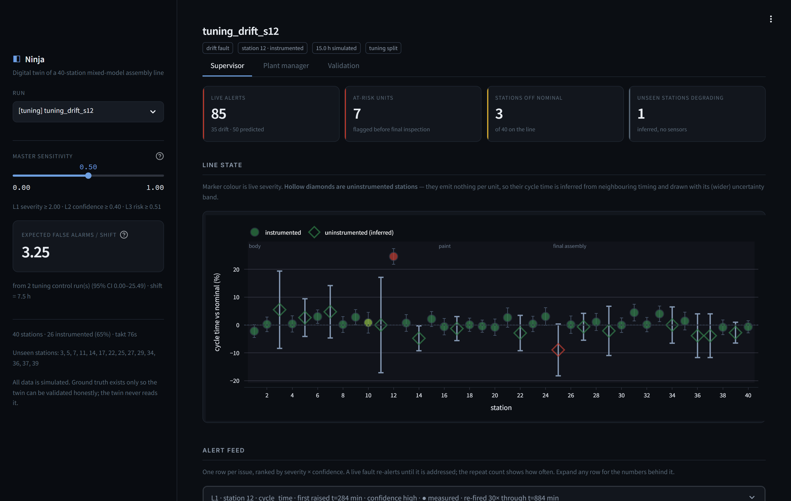
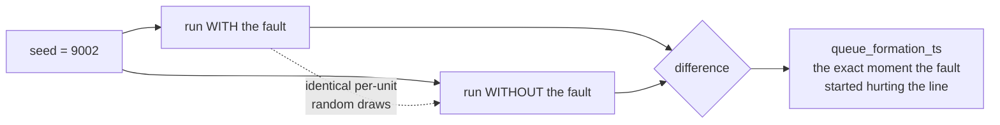
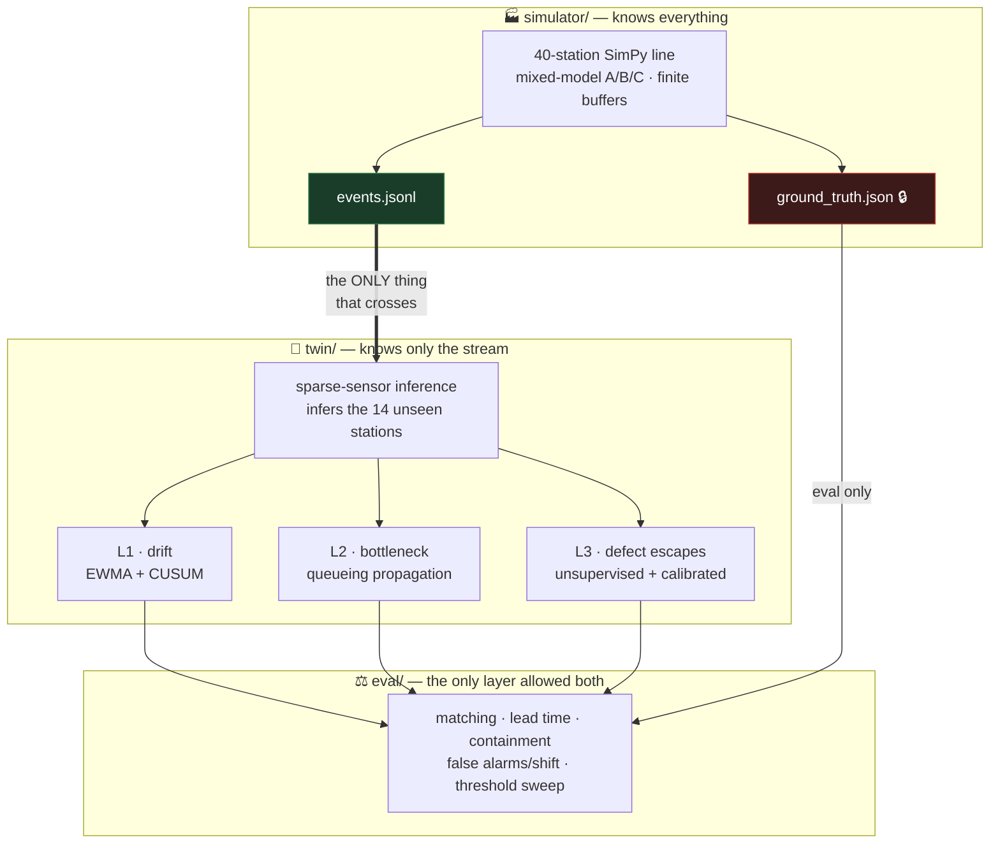
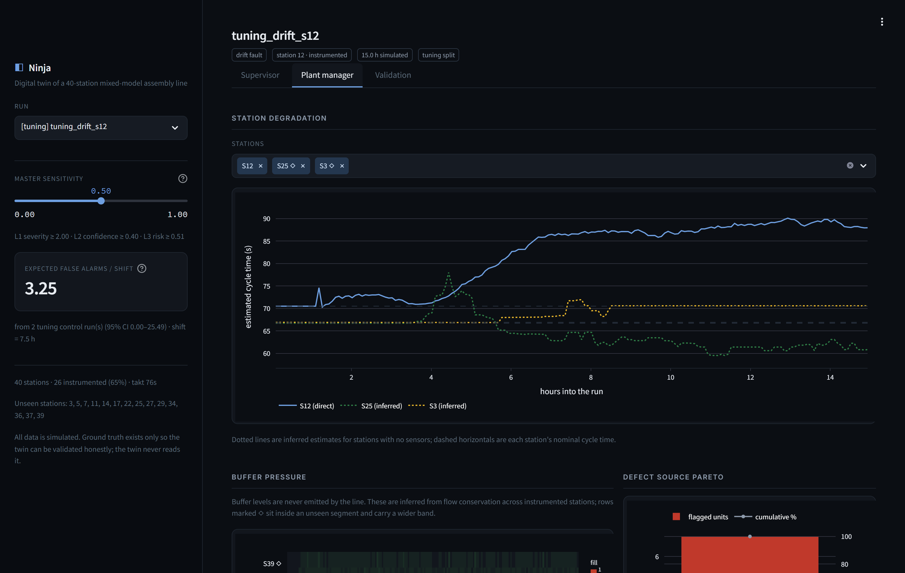
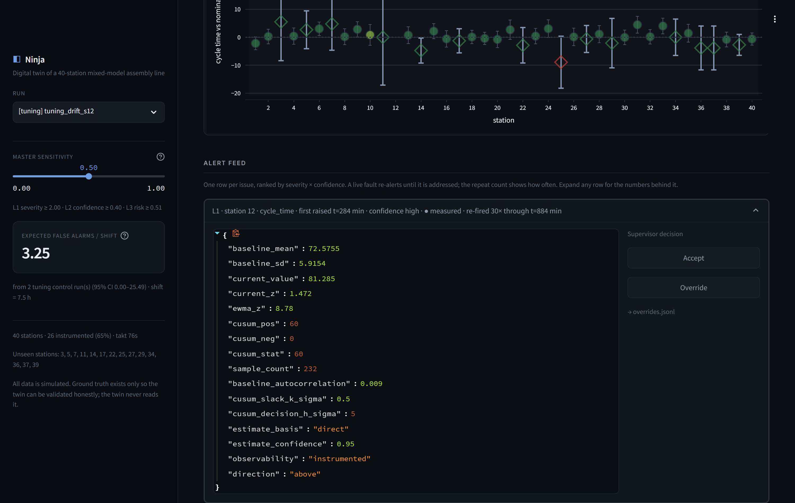
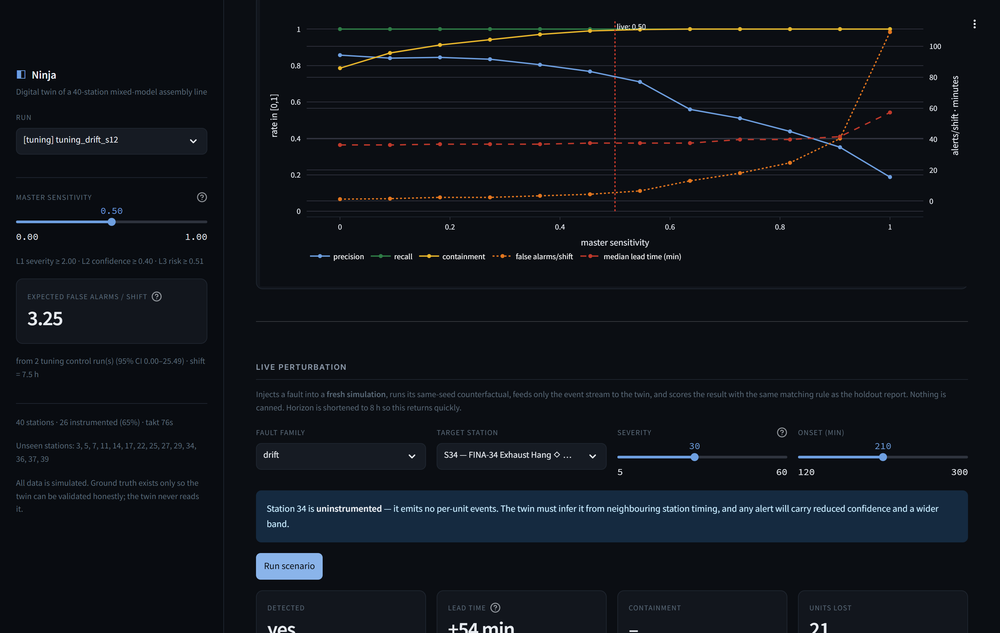
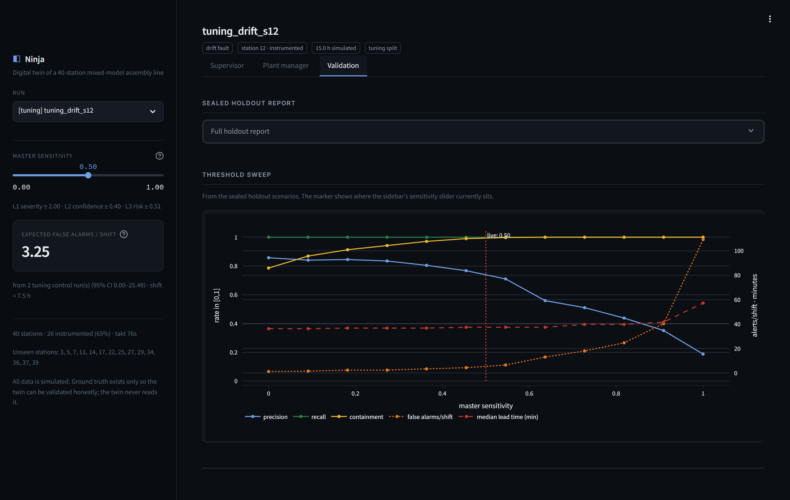

<div align="center">

# ◧ Ninja

### A digital twin that sees the bottleneck **37 minutes before the line backs up**

Working prototype for **DigitalTwin.ai** — Accenture Innovation Challenge Round 2, Problem Track 4

[](https://www.python.org/)
[](tests/)
[](https://simpy.readthedocs.io/)
[](https://streamlit.io/)
[](#quickstart)
[](LICENSE)

### ▶︎ [Watch the demo](https://youtu.be/_-GHJbrko5g)  ·  ◧ [Open the live dashboard](https://gautam-kri.github.io/ninja/)

<sub>The dashboard runs in your browser — no install, no setup.</sub>



</div>

---

## The short version

A 40-station mixed-model vehicle assembly line. Only **26 of the 40 stations have
sensors** — the rest emit nothing per unit. Buffer levels are never reported
anywhere. Somewhere in there, a station is slowly drifting, and in about two
hours the line will stop.

Ninja reads the event stream, infers what it cannot see, and calls it early.

<table>
<tr>
<td width="25%" align="center"><h3>+37 min</h3>median lead time<br><sub>before the queue forms</sub></td>
<td width="25%" align="center"><h3>99.2%</h3>defect containment<br><sub>caught before final inspection</sub></td>
<td width="25%" align="center"><h3>6 / 6</h3>faults detected<br><sub>on sealed holdout</sub></td>
<td width="25%" align="center"><h3>5.5</h3>false alarms / shift<br><sub>across 40 stations</sub></td>
</tr>
</table>

> Every figure above comes from **sealed holdout scenarios** scored against a
> **frozen config**, using a counterfactual baseline for ground truth.
> [Full report →](reports/holdout_report.md)

---

## All data is simulated. That is the point, not a shortcut.

A prediction system is only as credible as its answer to *"how do you know it was
early?"* — and on real plant data, that question has no clean answer. You don't
know when the bottleneck *would* have formed, or which cars *would* have failed
inspection.

In simulation you can know both, because you can run the counterfactual.



Both runs share per-unit random draws, so **any divergence between them is
attributable to the fault and nothing else**. `queue_formation_ts` is the first
buffer saturation that happens in the faulted run for 5 consecutive units that
did *not* saturate that buffer in the counterfactual — because buffers saturate
during normal operation too, and "first buffer hits capacity" would score the
detector against noise.

Every lead-time number in this repo is measured against that.

---

## Architecture: three layers, one hard boundary



**The twin never reads ground truth — and that's enforced structurally, not by
convention.** [`tests/test_isolation.py`](tests/test_isolation.py) runs the twin's
real entrypoint in a **subprocess**, in a directory containing `events.jsonl` and
nothing else, where `ground_truth.json` does not exist. A second test asserts the
twin's output is *byte-identical* whether or not ground truth sits on disk beside
it. A grep for imports would prove nothing; this does.

---

## The hard part: 35% of the line is invisible

14 of 40 stations emit **no per-unit events at all** — just a manual checklist
every ~10 units. Buffer levels are never emitted anywhere.

<div align="center">

<sub><b>Station 12 drifting 70s → 89s over the run.</b> Solid line = measured. Dotted = inferred for stations with no sensors.</sub>
</div>

<br>

| The twin must… | …and here's how |
|---|---|
| **Time a station it cannot see** | Time each VIN from the last instrumented station upstream to the first one downstream — but keep only units that entered a **starved** downstream anchor, so the measurement carries no queueing delay. Then attribute the deviation across the unknown stations by work content. |
| **Know a buffer's level** | Exactly, where both neighbours have sensors: `finishes(i-1) − starts(i)`. Inside an unseen segment the total WIP is exactly known but its *distribution* is not — so it's apportioned by capacity and reported as an interval, not a number. |
| **Never bluff** | Inferred estimates always carry a strictly wider band and a lower confidence score. **A station the twin cannot see renders low-confidence, never green.** |

One holdout fault is injected at an **uninstrumented** station. The twin localises
it correctly and calls it **34 minutes early** — at `medium` confidence, with a
band ~3× wider than the instrumented equivalent. It says what it doesn't know.

---

## Every alert shows its work

No black boxes. `evidence` is mandatory on every alert and carries the actual
numbers behind the score — a test asserts it.

<div align="center">

</div>

**L1 — drift.** EWMA + CUSUM per station per signal, self-calibrated on each
station's own warm-up. Emits a *continuous* severity; nothing is thresholded
inside the detector.

**L2 — bottleneck propagation.** Every 5 simulated minutes, projects 60–120
minutes ahead. Deterministic queueing arithmetic, not a nested simulation: a
station below its feed rate fills its buffer at a computable rate, so
time-to-saturation is division. Blocks walk upstream, starves walk downstream.
The band comes from running the same projection at the 10th/50th/90th percentile
estimates and scoring how many agree.

**L3 — defect escapes, with the cold start solved.** Inspection labels only exist
*after* units reach station 40, so a purely supervised L3 would have containment
of exactly zero by construction. So the primary path is **unsupervised and
available from unit one**: a car built through a station whose quality signal has
visibly shifted is at risk, weighted by its own deviation. A classifier calibrates
as labels arrive — but it **sharpens the primary score and never gates it**, so
deleting the model costs precision, never coverage.

---

## Prove it yourself, live

The Validation tab doesn't show you a saved result. It runs a **fresh
simulation**, a **fresh counterfactual**, re-runs the twin on the new event
stream and re-scores it with the same matching rule as the holdout report — in
about two seconds.

<div align="center">

<sub><b>A 30% drift injected at station 34 — which has no sensors — caught 54 minutes before the buffer saturated.</b></sub>
</div>

---

## Why you should believe the numbers

<table>
<tr><td width="30%"><b>🔒 Frozen config</b></td>
<td>Thresholds are sealed into <code>config/twin.frozen.yaml</code> with a SHA-256. <code>eval/run_holdout.py</code> <b>refuses to run</b> — hard-fails, not warns — if the live config no longer hashes to the frozen record.</td></tr>

<tr><td><b>🎲 Disjoint seeds</b></td>
<td>Tuning uses seeds 1000–1999, holdout 9000–9999, enforced <i>at config load time</i>. A holdout scenario cannot be an accidental replay of a tuned one.</td></tr>

<tr><td><b>⏱️ No free lunch on timing</b></td>
<td><b>An alert fired before fault onset is a false positive, not an early win.</b> Without that rule, a detector that alerted constantly would score perfect lead time.</td></tr>

<tr><td><b>🕊️ Honest false alarms</b></td>
<td>Measured <b>only</b> on control runs with no fault at all — the only place every alert is false by construction. On a faulted run you cannot separate a false alarm from a correct-but-mistimed one.</td></tr>

<tr><td><b>📊 Two lead-time columns, never averaged</b></td>
<td>Faults that form a queue are scored against queue formation. Faults that never form one have no such reference, so they're scored against onset — a detection <i>latency</i>, reported separately and negative.</td></tr>

<tr><td><b>🚫 No leakage into training</b></td>
<td><code>scripts/train_l3.py</code> checks every scenario by split, id prefix <i>and</i> seed range, and fails hard if a holdout scenario appears.</td></tr>
</table>

### The full sensitivity trade-off

One master `sensitivity` knob scales every threshold. Monotonicity isn't
empirical here — it's **structural**: thresholds fall monotonically, and greedy
earliest-first selection under a minimum-gap constraint is cardinality-optimal,
so a superset of candidates can never yield fewer alerts.

<div align="center">

</div>

| sensitivity | precision | recall | containment | false alarms/shift |
|---|---|---|---|---|
| 0.00 — quietest | 86% | 100% | 78% | 1.17 |
| **0.50 — shipped default** | **74%** | **100%** | **99%** | **5.50** |
| 1.00 — loudest | 19% | 100% | 100% | 109.17 |

<sub>The sweep grid has 12 evenly spaced points; 0.50 is the configured operating
point and its row comes from the holdout scorecard. Full grid:
<a href="reports/threshold_sweep.csv"><code>threshold_sweep.csv</code></a>.
<code>python -m eval.run_holdout</code> also writes a self-contained interactive
version to <code>reports/threshold_sweep.html</code>.</sub>

---

## Quickstart

```bash
pip install -r requirements.txt
python run_demo.py
```

Simulator → counterfactual → twin → scoring across four scenarios over 2 shifts
(15 h simulated), scorecard printed to stdout. **~12 seconds** from a clean
checkout. No GPU, no network, no API keys.

```bash
python run_demo.py --fast          # 6 h smoke run, ~5 s
python -m eval.run_holdout         # the sealed holdout scorecard
streamlit run app/streamlit_app.py # the Python operator console
```

### The web console

**Hosted, nothing to install: [gautam-kri.github.io/ninja](https://gautam-kri.github.io/ninja/)**

That build is a static export of the same front end, reading JSON baked from the
real engine on every push — scenario browsing, the 40-station line, the alert
feed with full evidence, and the sensitivity control all behave exactly as they
do locally. The one thing it cannot do is the live perturbation panel, which has
to run a new simulation and its counterfactual server-side; it says so in place
rather than replaying a saved result. For that, run it locally:

A Next.js front end over a read-only JSON API. Two processes, because the
engine stays Python and the UI never reaches past the API into it.

```bash
pip install -r api/requirements.txt
uvicorn api.main:app --port 8000
```

```bash
cd frontend && npm install && npm run dev
```

Then open **http://localhost:3000** for the walkthrough and
**http://localhost:3000/console** for the operator console. The console's live
perturbation panel runs a fresh simulation, its same-seed counterfactual and the
twin on demand — it is not a replay.

---

## Reproducing every number in this repo

The simulator is deterministic under its seed, so a clean checkout reproduces
every figure exactly.

```bash
rm -rf runs reports/holdout_results.json
python -m eval.freeze_thresholds --verify   # config still matches the freeze?
python -m eval.run_holdout                  # re-simulate, re-score, re-sweep
python -m eval.report                       # regenerate the report
```

---

## Calibration against real supply-chain data

```bash
python scripts/calibrate.py     # reads data/supply_chain.csv, if present
```

The dataset's schema is **not** assumed. `calibrate.py` prints every column it
found, fuzzy-matches on name *tokens* rather than substrings (`"late"` is a
substring of `"unrelated"` — a real bug this caught), states exactly what it
mapped to what and why, states every assumption including the time unit it
inferred, and writes a `calibration:` provenance block into `config/line.yaml`.
It handles an explicit delay column, a promised/actual date pair, or a bare
lead-time column.

**With no dataset present the pipeline still runs**, on documented defaults, and
says so loudly: a 0.5% base defect rate (the order of magnitude of the public
Bosch production-line dataset) and drift shapes qualitatively per AI4I 2020.

---

## Repo map

```
simulator/            SimPy model — knows everything
  engine.py             the discrete-event line
  rng.py                per-unit substreams → common random numbers
  ground_truth.py       counterfactual differencing → queue_formation_ts
  faults.py             drift · slowdown · quality · none

twin/                 the digital twin — reads events.jsonl and nothing else
  sparse.py             cycle-time inference for stations with no sensors
  state.py              baselines, EWMA/CUSUM, buffer inference
  l1_drift.py  l2_propagation.py  l3_defect.py
  thresholds.py         the monotone sensitivity → alert-set mapping

eval/                 the only layer allowed to read both sides
  freeze_thresholds.py  the freeze protocol
  matching.py           the alert matching rule
  metrics.py            lead time · containment · false alarms/shift
  run_holdout.py        scores the sealed split; refuses without a freeze

app/                  Streamlit operator console
api/                  thin FastAPI wrapper (presentation layer; no engine logic)
frontend/             Next.js operator console (Zone B); talks to api/ only
scripts/              calibrate.py · train_l3.py · capture_screenshots.py
config/               line · twin · eval · scenarios/{tuning,holdout}
tests/                51 tests
```

---

## Tests

```bash
python -m pytest        # 51 passed in ~60s
```

| Test | What it pins down |
|---|---|
| `test_isolation.py` | The twin completes in a directory where `ground_truth.json` **does not exist** — in a subprocess — and its output is byte-identical when it does |
| `test_determinism.py` | Same seed → byte-identical `events.jsonl`; buffer levels never appear in the stream; unseen stations emit only checklists |
| `test_detection.py` | A known drift yields a matched alert with positive lead time; an alert before onset scores as a **false positive**; the freeze hard-fails on a changed config |
| `test_sparse.py` | A fault at an unseen station is localised to it or a neighbour, at **strictly lower confidence** and with a **strictly wider band** than the instrumented equivalent |
| `test_cold_start.py` | L3 flags at-risk units before the first escape surfaces — with no model and no labels |
| `test_sweep_monotonicity.py` | False alarms/shift is weakly non-decreasing in sensitivity, and alert sets are structurally nested |
| `test_l3_fallback.py` | With no model file — and with a corrupt one — the pipeline still runs and L3 still flags |

---

## Honest limitations

We'd rather you read these here than find them yourself.

- **L2 is accurate rather than early.** It projects consequences of the line's
  *current* state, so on a gradual drift it fires close to the queue it predicts.
  The headline lead time comes from L1; L2 contributes the cause station and the
  specific downstream consequence.
- **The false-alarm confidence interval is wide** (n=3 control runs). It's
  reported rather than hidden, lower bound clamped at zero because a rate can't
  be negative.
- **Precision uses a second, weaker rule than lead time**, and both are reported.
  An alert naming the faulted station three hours after the queue formed still
  points at a real, unresolved fault.
- **One disclosed methodology note.** Thresholds were calibrated on tuning
  controls then frozen. One *structural* L2 change — a prediction inheriting the
  confidence of the weakest link in its inference chain rather than the average —
  was made after observing aggregate holdout *control* alert counts. It was a
  principled change, not a fit to those scenarios, but it's disclosed here rather
  than buried.

---

## Engineering notes

- Python 3.11+ (developed on 3.13). Dependencies pinned in `requirements.txt`.
- **All internal time is seconds (float).** Conversion to minutes happens only at
  the reporting and UI boundary.
- No hardcoded detections, no canned replay, no `random()` standing in for
  inference.
- The twin runs **once** per scenario, emitting every candidate above the
  sensitivity-1 floor — so a 12-point threshold sweep is a filter over cached
  candidates, not 12 re-runs.

---

<div align="center">

**[Watch the demo →](https://youtu.be/_-GHJbrko5g)**  ·  **[Open the dashboard →](https://gautam-kri.github.io/ninja/)**

<sub>Built for the Accenture Innovation Challenge · MIT licensed</sub>

</div>
